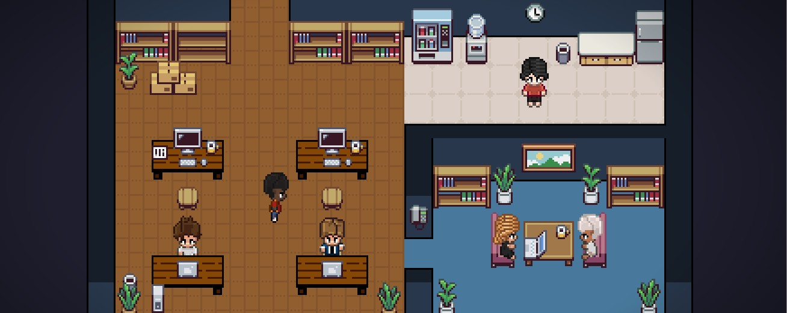

# Pixel Office Web

A corporate web dashboard for [OpenClaw](https://openclaw.ai) — visualize, monitor, and chat with your AI agents in real time through an interactive pixel-art office or a modern dashboard view.



---

## Features

- **Dashboard** — cards for every configured agent showing live status (Thinking, Executing, Writing, Waiting, Idle, Offline)
- **Pixel Office** — animated characters walk and react as agents work; tool calls appear as speech bubbles
- **Real-time chat** — markdown-rendered conversation with streaming, per-agent history in localStorage
- **Agent registry** — configure which agents appear on the dashboard; offline agents show as greyed-out placeholders
- **Channel badges** — see which messaging channels (WhatsApp, Telegram, Slack, etc.) each agent is connected to
- **Editable office layout** — sidebar editor to place furniture, change floors/walls; undo/redo; save to JSON
- **Responsive navigation** — collapsible sidebar on desktop, bottom tab bar on mobile
- **Auto-reconnect** — frontend and backend both reconnect automatically if the gateway goes down
- **Session auth** — simple login screen with configurable credentials

---

## Architecture

```
Browser (React + Canvas)
    |  HTTP + WebSocket
    v
server.js  (Node / Express)    ← http://localhost:3000 + /ws
    |  WebSocket
    v
OpenClaw gateway  (your VPS)   ← ws://<your-openclaw-host>:18789
```

| Port | Service |
|------|---------|
| 8090 | Vite dev server (frontend, dev only) |
| 3000 | `server.js` — HTTP API + `/ws` WebSocket bridge |

See [`docs/architecture.md`](docs/architecture.md) for a deeper breakdown.

---

## Prerequisites

- **Node.js** 18+
- An **OpenClaw** instance with operator access
- Your OpenClaw gateway URL and admin token

---

## Quick Start

### 1. Clone and install

```bash
git clone <your-repo-url>
cd office-web
npm install
```

### 2. Configure environment

Copy the example and edit:

```bash
cp .env.example .env
```

Edit `.env` with your values:

```bash
# ── Web UI credentials ──
PIXEL_USER=admin
PIXEL_PASS=your_strong_password

# ── OpenClaw connection ──
OPENCLAW_URL=http://your-openclaw-host:18789
OPENCLAW_TOKEN=your-admin-token

# ── Optional ──
PORT=3000                              # Server port (default: 3000)
OPENCLAW_IDENTITY_PATH=/path/to/key    # Custom path for device identity file
```

**Docker/container note:** Inside a Linux container, use the Docker bridge IP instead of `localhost`:

```bash
OPENCLAW_URL=http://172.17.0.1:18789   # Linux containers
OPENCLAW_URL=http://host.docker.internal:18789  # macOS Docker Desktop
```

### 3. Approve the device (first run only)

On first start, the backend generates an Ed25519 key pair stored at `~/.pixel-office-identity.json`. OpenClaw requires device approval:

```bash
# On your OpenClaw VPS
openclaw devices list
openclaw devices approve <deviceId>
```

You only need to do this once per machine. If the identity file is lost (container rebuild, etc.), a new device is generated and requires re-approval.

### 4. Run

```bash
# Terminal 1 — backend proxy
node server.js

# Terminal 2 — frontend dev server
npm run dev
```

Open `http://localhost:8090` and log in with your `PIXEL_USER`/`PIXEL_PASS` credentials.

### 5. Build for production

```bash
npm run build
node server.js   # serves the built frontend + API on port 3000
```

---

## Configuring Agents

Agents are configured in two files:

### `src/agentConfig.ts` — Agent Registry

This file defines which agents appear on the **Dashboard**. Every agent listed here will always show a card — online agents display live status, offline ones appear as greyed-out "Offline" placeholders.

```ts
export const CONFIGURED_AGENTS: AgentDef[] = [
  { name: 'Jarvis',            folderName: 'jarvis',            color: '#5a8cff' },
  { name: 'Dev',               folderName: 'dev',               color: '#4ade80' },
  { name: 'Infra',             folderName: 'infra',             color: '#fb923c' },
  { name: 'support-agent',     folderName: 'support-agent',     color: '#a78bfa' },
  { name: 'qa-tester',         folderName: 'qa-tester',         color: '#38bdf8' },
  { name: 'data-custodian',    folderName: 'data-custodian',    color: '#f472b6' },
  { name: 'service-ops',       folderName: 'service-ops',       color: '#34d399' },
  { name: 'analytics',         folderName: 'analytics',         color: '#fbbf24' },
  { name: 'security-watchdog', folderName: 'security-watchdog', color: '#f87171' },
  { name: 'change-manager',    folderName: 'change-manager',    color: '#e879f9' },
];
```

**To add a new agent:**

1. Add an entry to `CONFIGURED_AGENTS` with:
   - `name` — Display name shown on the card
   - `folderName` — Must match the OpenClaw agent folder name (case-insensitive)
   - `color` — Hex color for the card accent

2. Add a color entry in `src/agentColors.ts` for the pixel office character:

```ts
const RESIDENT_COLORS: Record<number, string> = {
  1: '#5a8cff',  // Jarvis
  2: '#f472b6',  // (reserved)
  3: '#4ade80',  // Dev
  // ... add your agent's ID and color
};
```

**To remove an agent:** Simply delete its entry from `CONFIGURED_AGENTS`. Agents connected to OpenClaw but NOT in this list are hidden from the Dashboard.

### How agent matching works

When an agent connects to OpenClaw, the server sends its `folderName`. The Dashboard matches this against `CONFIGURED_AGENTS` entries (case-insensitive). If a match is found, the card goes from "Offline" to showing live status. Unmatched agents are hidden.

---

## Agent Status Reference

| Status | Label | Meaning |
|--------|-------|---------|
| Thinking | PENSANDO | Agent is processing/reasoning |
| Executing | EXECUTANDO | Agent is running a tool (bash, search, etc.) |
| Writing | ESCREVENDO | Agent is streaming a response |
| Waiting | AGUARDANDO | Agent needs permission to proceed |
| Idle | INATIVO | Agent is online but not doing anything |
| Offline | OFFLINE | Agent is configured but not connected to OpenClaw |

---

## Navigation

### Desktop (>= 768px)

- **Sidebar** on the left with icons for Office, Dashboard, Chat, and Settings
- Collapses to icon-only (48px) in Office view, expands (200px) in Dashboard view
- Click the toggle arrow to expand/collapse manually (state saved in localStorage)
- **Edit Layout** button appears in the top-right of Office view to enter the layout editor

### Mobile (< 768px)

- **Bottom tab bar** with 4 tabs: Office, Dashboard, Chat, Settings
- Layout editor accessible via floating button in Office view

---

## Usage

| Action | How |
|--------|-----|
| **View agents** | Open Dashboard — all configured agents show as cards |
| **Chat with agent** | Click "Chat" on an agent card, or use the Chat nav item |
| **Monitor activity** | Cards update in real-time: status, active tools, last message |
| **Edit office** | Click "Edit Layout" button (top-right in Office view) |
| **Place furniture** | Select from catalog in the editor sidebar, click to place |
| **Change floors/walls** | Use Floor/Wall tabs in the editor sidebar |
| **Undo/Redo** | Use buttons at the top of the editor sidebar |
| **Save layout** | Click Save in the editor sidebar (persists to localStorage) |
| **Logout** | Click the logout icon in the sidebar, or via Settings |

---

## Project Structure

```
office-web/
├── server.js                    # Node proxy: OpenClaw auth, WS bridge, session auth
├── .env.example                 # Environment variable template
├── src/
│   ├── App.tsx                  # Root component: routing, state management
│   ├── main.tsx                 # React entry point
│   ├── index.css                # Global styles + CSS variables
│   ├── agentConfig.ts           # Agent registry (which agents appear on dashboard)
│   ├── agentColors.ts           # Color palette per agent ID
│   ├── browserMock.ts           # WebSocket client, event dispatch, auto-reconnect
│   ├── constants.ts             # App constants
│   ├── runtime.ts               # Runtime detection (browser vs Node)
│   ├── components/
│   │   ├── navigation/
│   │   │   ├── AppShell.tsx     # Orchestrator: Sidebar or MobileTabBar
│   │   │   ├── Sidebar.tsx      # Desktop sidebar navigation
│   │   │   ├── MobileTabBar.tsx # Mobile bottom tab bar
│   │   │   ├── NavItem.tsx      # Reusable nav item component
│   │   │   └── NavIcons.tsx     # SVG icon components
│   │   ├── DashboardView.tsx    # Agent cards grid with live status
│   │   ├── AgentCard.tsx        # Individual agent card component
│   │   ├── ChatView.tsx         # Chat interface per agent
│   │   ├── TerminalPanel.tsx    # Chat panel (markdown, streaming)
│   │   ├── LoginScreen.tsx      # Authentication screen
│   │   └── SettingsModal.tsx    # Settings dialog
│   ├── hooks/
│   │   ├── useExtensionMessages.ts  # Agent event processing from WebSocket
│   │   ├── useEditorActions.ts      # Layout editor undo/redo/save logic
│   │   └── useIsMobile.ts          # Responsive breakpoint hook
│   └── office/
│       ├── components/
│       │   ├── OfficeCanvas.tsx     # 2D canvas renderer
│       │   └── ToolOverlay.tsx      # Speech bubbles over characters
│       ├── editor/
│       │   └── EditorToolbar.tsx    # Layout editor sidebar panel
│       ├── engine/
│       │   └── officeState.ts       # Game state (characters, furniture)
│       ├── layout/                  # Furniture catalog & serialization
│       └── sprites/                 # Character sprite management
├── public/assets/               # Sprites, floors, walls, furniture images
└── docs/                        # Detailed documentation
```

---

## Documentation

| Doc | Description |
|-----|-------------|
| [`docs/architecture.md`](docs/architecture.md) | System design, message bus, event flow |
| [`docs/openclaw-protocol.md`](docs/openclaw-protocol.md) | WebSocket protocol, auth, all event types |
| [`docs/frontend.md`](docs/frontend.md) | React components, hooks, canvas rendering |
| [`docs/development.md`](docs/development.md) | Dev workflow, debugging, common issues |
| [`docs/deploy-runtime.md`](docs/deploy-runtime.md) | Deploy notes, Linux container networking, pairing |

---

## Tech Stack

| Layer | Technology |
|-------|------------|
| Frontend | React 19 + TypeScript + Vite |
| Backend | Express 5 + WebSocket (ws) |
| Rendering | Canvas 2D |
| Markdown | Marked + highlight.js |
| Auth | Session cookies (24h TTL) |
| Styling | CSS variables, inline styles |

---

## Upgrading from older versions

### Pull latest and reinstall

```bash
git pull origin main
npm install
```

### Key changes to be aware of

#### RESIDENTS array in `server.js`

The `RESIDENTS` array in `server.js` defines which agents are pre-announced to the frontend. If you customized this array in an older version, you'll need to update it. The current version registers **all 10 configured agents** with `alwaysAnnounce: true`:

```javascript
const RESIDENTS = [
  { id: 1,  name: 'Jarvis',            sessionKey: 'agent:main:main',              alwaysAnnounce: true },
  { id: 3,  name: 'Dev',               sessionKey: 'agent:dev:dev',                alwaysAnnounce: true },
  { id: 4,  name: 'Infra',             sessionKey: 'agent:infra:infra',            alwaysAnnounce: true },
  // ... all other agents
];
```

**To add a new agent**, you need to update **both** files:

1. **`server.js` → `RESIDENTS`** — Add an entry with a unique `id`, the agent `name` (matching OpenClaw folder), the full `sessionKey`, and `alwaysAnnounce: true`
2. **`src/agentConfig.ts` → `CONFIGURED_AGENTS`** — Add an entry with `name`, `folderName`, and `color`

The `sessionKey` format is `agent:<workspace>:<agent-name>`. For agents in the main workspace, it's `agent:main:<agent-name>`. For agents with dedicated workspaces (like Dev or Infra), it's `agent:<workspace>:<workspace>`.

> **Important:** Agent IDs must be unique and never reuse a previously deleted ID (to avoid localStorage chat history collisions). The `nextAgentId` is calculated automatically from the highest ID in `RESIDENTS`.

#### Lexi removed

Agent "Lexi" (id 2) was removed. If your local `agentColors.ts` or `server.js` still references Lexi, delete those entries. ID 2 is reserved/unused.

#### Offline placeholder system

Configured agents that aren't connected to OpenClaw now appear as semi-transparent (35% opacity) characters in the Pixel Office and as "OFFLINE" cards in the Dashboard. No action needed — this works automatically based on `CONFIGURED_AGENTS`.

#### Navigation overhaul

The old `BottomToolbar` was replaced with a responsive navigation system:
- **Desktop:** Collapsible sidebar (left side)
- **Mobile:** Bottom tab bar

If you had custom CSS targeting `BottomToolbar`, remove it.

#### localStorage keys

If the office layout looks broken after updating, clear the cached layout:

```javascript
// In browser console
localStorage.removeItem('pixel-office-layout');
localStorage.removeItem('pixel-office-editMode');
```

The layout will regenerate from the bundled default on next reload.

---

## Roadmap

- [ ] Firebase Auth (Google Sign-In) for production auth
- [ ] Admin UI for agent configuration (Firestore-backed)
- [ ] Multi-workspace support
- [ ] Dark/light theme toggle
- [ ] Agent notifications (sound + desktop)

---

## License

MIT
